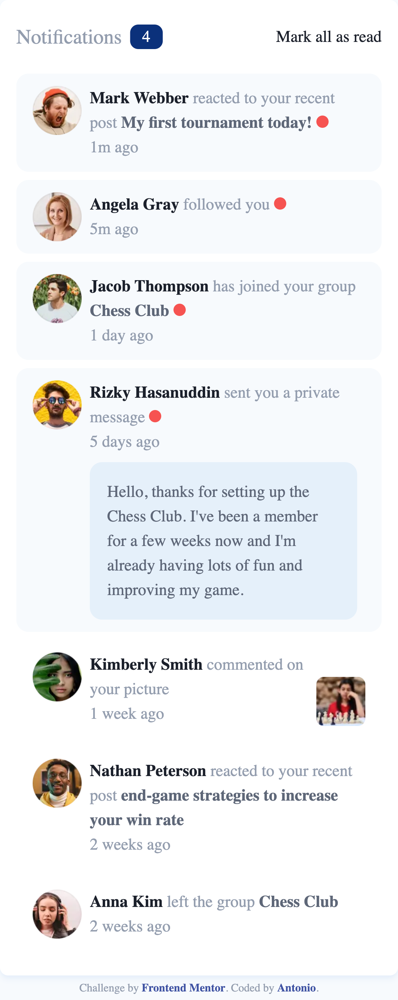

# Frontend Mentor - Notifications page solution

This is a solution to the [Notifications page challenge on Frontend Mentor](https://www.frontendmentor.io/challenges/notifications-page-DqK5QAmKbC). Frontend Mentor challenges help you improve your coding skills by building realistic projects.

## Table of contents

- [Overview](#overview)
  - [The challenge](#the-challenge)
  - [Screenshot](#screenshot)
  - [Links](#links)
- [My process](#my-process)
  - [Built with](#built-with)
  - [What I learned](#what-i-learned)
  - [Continued development](#continued-development)
  - [Useful resources](#useful-resources)
- [Author](#author)
- [Acknowledgments](#acknowledgments)

**Note: Delete this note and update the table of contents based on what sections you keep.**

## Overview

### The challenge

Users should be able to:

- Distinguish between "unread" and "read" notifications
- Select "Mark all as read" to toggle the visual state of the unread notifications and set the number of unread messages to zero
- View the optimal layout for the interface depending on their device's screen size
- See hover and focus states for all interactive elements on the page

### Screenshot




### Links

- Solution URL: [Click here](https://github.com/Antonio0402/notifications-page-redux-toolkits)
- Live Site URL: [Click here](https://notifications-page-redux-toolkit.netlify.app/)

## My process

### Built with

- Semantic HTML5 markup
- CSS custom properties
- Flexbox
- CSS Grid
- Mobile-first workflow
- Typescript
- [React](https://reactjs.org/) - JS library
- [Redux Toolkit](https://redux-toolkit.js.org/) - State management
- [Tailwindcss](https://tailwindcss.com) - Tailwindcss

### What I learned

- Create a page from scratch using React JS and styling seperated components with all CSS using utilities classes first approach;
- Using third-party react's state management to handle the state of interactive tab
- Fetching data from serverless functions by using redux tooklkits to handle the query stage
- Using conditional react's to update the tab's state and mutation query to update data on the server
- Applying typescript for a safety checking and consistent of react's types

To see how you can add code snippets, see below:

#### Serverless funtion

```js
const handler: Handler = async (
  event: HandlerEvent,
  _context: HandlerContext
) => {
  if (event.httpMethod === "PATCH") {
    if (event.body) {
      const params = JSON.parse(event.body);
      for (const noti of data.notifications) {
        if (noti.id === Number(params?.id)) {
          noti.isUnread = !noti.isUnread;
          break;
        }
      }
      return {
        statusCode: 202,
        body: JSON.stringify(data),
      };
    }
  }

  return {
    statusCode: 200,
    body: JSON.stringify(data),
  };
};

export { handler };
```

#### Redux toolkits API

```js
export const NotiApi = createApi({
  reducerPath: "api",
  baseQuery: fetchBaseQuery({
    baseUrl: "/.netlify/functions/",
  }),
  tagTypes: ["Noti"],
  endpoints: (builder) => ({
    getAll: builder.query<{ notifications: Notifications[] }, void>({
      query: () => "notifications",
      providesTags: [{ type: "Noti", id: "BADGES" }],
    }),
    readNoti: builder.mutation<Notification, { id: number; isUnread: boolean }>(
      {
        query: ({ id, isUnread }) => ({
          url: `notifications/${id}`,
          method: "PATCH",
          body: { id, isUnread },
        }),
        async onQueryStarted({ id, isUnread }, { dispatch, queryFulfilled }) {
          const patchResult = dispatch(
            NotiApi.util.updateQueryData("getAll", undefined, (draft) => {
              const noti = draft.notifications.find((n) => n.id === id);
              if (noti) noti.isUnread = isUnread;
            })
          );
          try {
            await queryFulfilled;
          } catch (error) {
            patchResult.undo();
          }
        },
      }
    ),
  }),
});
```

### Continued development

- I am going to keep trying to have a good grasp of using Redux Toolkits for complicated state in more advanced projects.
- Striving to optimizing the react's state flow throught the re-renders and decrease the javascript bundlesize by applying React server components for static side generators in the future projects.

### Useful resources

- [Tailwind CSS](https://tailwindcss.com/)
- [Redux Toolkit](https://redux-toolkit.js.org/)
- [Redux Toolkits Tutorial - Dave Gray](https://youtu.be/NqzdVN2tyvQ)

## Author

- Frontend Mentor - [@Antonio0402](https://www.frontendmentor.io/profile/Antonio0402)

## Acknowledgments

So much thanks specially to Dave Gray Youtube Chanel and Jack Herrington for absolute amazing and thoroughly knowledges about how React TS works as well as best practises for using Redux Toolkits. These are the best React contents for implement the basic concept into the real world projects you can find on Youtube.
